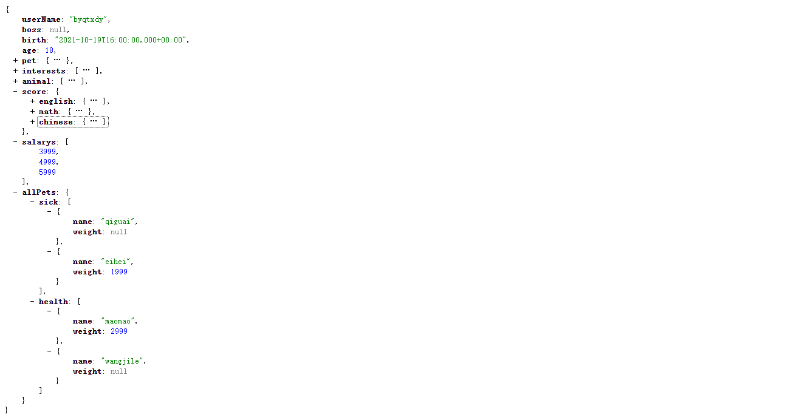
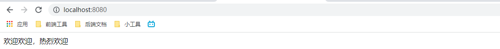

# SpringBoot

## Hello World

1. 通过 IDEA Maven 创建工程

2. 导入依赖

   ```xml
   <parent>
       <groupId>org.springframework.boot</groupId>
       <artifactId>spring-boot-starter-parent</artifactId>
       <version>2.3.4.RELEASE</version>
   </parent>
   
   
   <dependencies>
       <dependency>
           <groupId>org.springframework.boot</groupId>
           <artifactId>spring-boot-starter-web</artifactId>
       </dependency>
   </dependencies>
   ```

3. 在 `main/resource` 下创建 **application.properties** 作为项目统一的配置文件

   ```properties
   # 修改 web 应用启动端口号
   server.port=8888
   ```

   更多配置参考：https://docs.spring.io/spring-boot/docs/current/reference/html/application-properties.html#application-properties

4. 在 `main/java` 下创建包和对应的 **MainApplication** 作为程序的启动类

   ```java
   @SpringBootApplication // 标注该类为主程序启动类
   public class MainApplication {
   
       public static void main(String[] args) {
           SpringApplication.run(MainApplication.class, args);
       }
   
   }
   ```

5. 在**主程序包下**创建控制器和对应的请求接口方法

   ```java
   @RestController
   public class TestController {
   
       @RequestMapping("/hello")
       public String testHello() {
           return "hello";
       }
   
   
   }
   ```

6. 通过 **MainApplication** 左侧的小箭头启动应用

   

7. 访问` localhost:8888/hello` 测试

8. [打包项目] 引入依赖

   ```xml
   <build>
       <plugins>
           <plugin>
               <groupId>org.springframework.boot</groupId>
               <artifactId>spring-boot-maven-plugin</artifactId>
           </plugin>
       </plugins>
   </build>
   ```

9. 通过 IDEA 右侧工具快速打包

   

10. 关闭 IDEA 启动的服务，通过命令行 `java -jar jar包名` 也可以启动项目

    

11. 访问接口测试

## 注解使用

### @Configuration

作用：标注该类是一个配置类(相当于配置文件)

使用：配合 **@Bean** 向容器中添加组件

```java
@Configuration // 标注该类为一个配置类
public class CustomConfig {

    /**
     * 通过 @Bean 注解向容器中注册组件，组件的 key(id) 为方法名，返回值就是组件实例
     * @return
     */
    @Bean
    public User user01() {
        return new User("zhangsan", 18);
    }

    /**
     * 也可以通过 @Bean.value 属性指定组件的 key(id)
     * @return
     */
    @Bean("dog")
    public Pet pet01() {
        return new Pet("dog");
    }

}
```

注意：

1. 配置类本身也会作为组件注册到 IOC 容器中

2. 配置类中通过 **@Bean** 配置的组件，默认也是**单实例**的

3. 其属性  `proxyBeanMethods` 可以用来调整 **Full / Lite** 模式

   当其为 `false` 时，表示 **Lite** 模式，代表不会为当前配置类生成代理对象，调用该代理类中的有关 **@Bean** 注解的方法时，会直接调用而不是现在容器中查找

   当其为 `true` 时，表示 **Full** 模式，代表会为当前配置类生成代理对象，调用该代理类中的有关 **@Bean** 注解的方法时，会先在容器中找对应的组件

   ```java
   @Bean
   public User user01() {
       // Lite: 会在调用依次 pet01() 方法; Full: 会现在容器中找对应的方法返回的组件
       System.out.println(pet01());
       return new User("zhangsan", 18);
   }
   
   @Bean("dog")
   public Pet pet01() {
       return new Pet("dog");
   }
   ```

   **主要是解决组件依赖的问题**，建议当不需要使用上述情况(一个组件需要调用另一个注册的组件)时，可以手动设置为 `false` 加速容器启动过程

### @Import

作用：导入组件

使用：在类上使用该注解导入指定组件

```java
@Configuration // 标注该类为一个配置类
@Import({DBHelper.class, User.class})
public class CustomConfig {
```

该注解会调用指定**类的无参构造器**创建组件实例后以**类的全类名**作为 key 保存到容器中

### @Conditional

作用：在注册组件时，需要满足相对应的条件才可以注册该组件


使用：在注册组件时使用即可

```java
@ConditionalOnBean(name = "tom") // 只有当容器中存在 key 为 tom 的组件时才会注册该组件(CustomConfig)
public class CustomConfig {
}

@ConditionalOnMissingBean({ Pet.class }) // 只有当容器中不存在 Pet 类型的组件时才会注册该组件
public User user01() {
}
```

### 配置绑定

> 读取 properties 文件中的内容并封装到 JavaBean 中，以供随时使用

在配置文件中定义要使用的属性

```properties
mycat.name=BYQ
mycat.price=100000
```

#### @EnableConfigurationProperties + @ConfigurationProperties

在组件中使用 **@ConfigurationProperties**

```java
@ConfigurationProperties(prefix = "mycat") // 通过 prefix/value 指定配置文件中要获取属性的前缀
public class Cat {
```

在配置类中使用 **@EnableConfigurationProperties**

```java
@EnableConfigurationProperties({Cat.class})
public class CustomConfig {
```

该注解有两个作用：

1. 为指定的类开启配置绑定功能
2. 将指定的类注册到 IOC 容器中

#### @Component + @ConfigurationProperties

```java
@ConfigurationProperties(prefix = "mycat") // 通过 prefix/value 指定配置文件中要获取属性的前缀
@Component
public class Cat {

    // 属性名需要和配置文件中的属性去掉前缀后的一样
    private String name;
    private Integer price;
 
    // 需要为读取的属性定义 set() 方法
    ...
}
```

## 开发小技巧

### Lombok

作用：简化 JavaBean 开发

使用：

1. 导入依赖

   ```xml
   <dependency>
       <groupId>org.projectlombok</groupId>
       <artifactId>lombok</artifactId>
   </dependency>
   ```

2. 为 IDEA 安装 Lombok 插件

   

3. 在 JavaBean 上使用相关注解

   ```java
   @Data               // 自动为属性生成 get set 方法, 也可以使用  @Getter + @Setter
   @NoArgsConstructor  // 自动生成无餐构造器
   @AllArgsConstructor // 自动生成全餐构造器
   @ToString           // 自动重写 toString()
   @EqualsAndHashCode  // 自动重写 equals & hashCode
   @Slf4j              // 为当前类自动注入一个 log 属性，用来进行日志打印
   public class Cat {
   
       private String name;
       private Integer price;
   
   }
   ```

### Dev-tools

作用：自动重启

使用：

1. 导入依赖

   ```xml
   <dependency>
       <groupId>org.springframework.boot</groupId>
       <artifactId>spring-boot-devtools</artifactId>
       <optional>true</optional>
   </dependency>a
   ```

2. 启动项目后进行任意修改后按下 **Ctrl + F9** 即可

> 用处不大

### Spring Initializr

作用：快速创建 SpringBoot 项目

使用：在 IDEA 中创建新项目/模块时可以使用


## 配置文件

### yaml 使用

> yaml 是一种非常适合做以数据为中的配置文件

#### 基本语法

- `key: value`, kv 之间存在空格
- 大小写敏感
- 使用缩进表示层级关系
- 缩进不允许使用 **tab**，只允许空格
- 缩进的空格数不重要，只要相同层级的元素左对齐即可
- `#` 表示注释
- 字符串无需加引号，`''`与`""`表示字符串内容会 被转义/不被转义(是否转义成普通字符串)

#### 数据类型

- 字面量：单个的，不可再分的值。例如：date / boolean / string / number / null

  ```yaml
  k: v
  ```

- 对象：键值对的集合。例如：map / hash / set / object

  ```yaml
  # 行内写法
  k: {k1:v1,k2:v2,k3:v3}
  # 或者
  k:
    k1: v1
    k2: v2
    k3: v3
  ```

- 数组：一组按一定排序方式排列的值。例如: array / list / queue

  ```yaml
  # 行内写法
  k: [v1,v2,v3]
  # 或
  k:
    - v1
    - v2
    - v3
  ```

#### 示例

```java
@Data
@Component
@ConfigurationProperties(prefix = "person")
public class Person {

    private String userName;
    private Boolean boss;
    private Date birth;
    private Integer age;
    private Pet pet;
    private String[] interests;
    private List<String> animal;
    private Map<String, Object> score;
    private Set<Double> salarys;
    private Map<String, List<Pet>> allPets;

}

@Data
public class Pet {

    private String name;
    private Double weight;

}
```

在 `src/main/resources	` 下创建 `application.yaml` / `application.yml` (二者都可)

```yaml
person:
  userName: byqtxdy
  boos: false
  # 默认的日期格式用 /
  birth: 2021/10/20
  age: 18
  pet:
    name: 阿猫
    weight: 199.9
  interests: [ 篮球,敲代码,旅游 ]
  animal:
    - 狗狗
    - 猫
  score:
    english:
      first: 30
      second: 40
      third: 50
    math: [ 131,140,150 ]
    # 对象的行内写法，属性和属性值之间可以不用空格
    chinese: { first:128,second:136 }
  salarys: [ 3999,4999,5999 ]
  allPets:
    sick:
      - { name: qiguai }
      - name: eihei
        weight: 1999
    # 如果对象数组需要使用行内写法，则对象的属性和属性值之间也要加空格
    health: [ { name: maomao,weight: 2999 },{ name: wangjile } ]
```

编写一个控制器方法，查看属性是否注入成功



#### 配置提示

> 普通的 JavaBean 在编写时是没有提示

修改依赖文件

```xml
<!-- 添加依赖 -->
<dependency>
    <groupId>org.springframework.boot</groupId>
    <artifactId>spring-boot-configuration-processor</artifactId>
    <optional>true</optional>
</dependency>

<!-- 在打包的时候排除该依赖，应该该依赖只是在开发的使用有用，部署没必要 -->
<build>
    <plugins>
        <plugin>
            <groupId>org.springframework.boot</groupId>
            <artifactId>spring-boot-maven-plugin</artifactId>
            <configuration>
                <excludes>
                    <exclude>
                        <groupId>org.springframework.boot</groupId>
                        <artifactId>spring-boot-configuration-processor</artifactId>
                    </exclude>
                </excludes>
            </configuration>
        </plugin>
    </plugins>
</build>
```

重启项目，再次编写配置文件


## Web 

### 简单功能分析

#### 静态资源访问

默认的静态资源文件下路径：类路径(`/main/resources`)下的 `/static` or `/resources` or `/META-INF/resouces` or `/public`

原理：配置静态资源处理器映射关系为 `/**`，当游览器发送请求时，先判断是否有对应的请求接口，如果没有再有静态资源处理器处理

> 配置

1. 修改静态资源访问前缀

   ```yaml
   spring:
     mvc:
       static-path-pattern: /res/**
   ```

   作用：访问静态资源时需要加上前缀 `/res`

2. 修改静态资源文件夹路径

   ```yaml
   spring:
     resources:
       static-locations: classpath:/haha/
   ```

   让其他默认的四个静态资源文件夹全部失效，重新设置静态资源文件夹

> 扩展 - webjars

作用：将一些 JS/CSS 框架弄成了 jar 包，也可以在 Maven 中引入使用

使用：https://www.webjars.org/

1. 导入依赖

   ```xml
   <dependency>
       <groupId>org.webjars</groupId>
       <artifactId>jquery</artifactId>
       <version>3.5.1</version>
   </dependency>
   ```

2. 可以在 lib 模块下查看相关静态资源文件

   

3. 以访问图上的 `jquery.js` 为例，访问 `/webjars/jquery/3.5.1/jquery.js` 即可

   

   实际上就是 jar 包中静态资源的路径

#### 欢迎页支持

只需要在 静态资源文件夹 下创建 `index.html` 即可直接访问，但注意不能配置 `spring-mvc-static-path-pattern`(2.3.4 中是这样，好像2.5修复了，知道的小伙伴可以在评论区说一下)



#### 自定义 Favicon

和配置 `index.html` 一样，默认名为 `favicon.ico` ，测试的时候注意重启游览器避免缓存即可

### 请求参数处理(注解)

- @RequestParam / @RequestHeader / @RequestBody / @CookieValue / @PathVariable

  基础使用可以参考 SpringMVC：TODO

  扩展：

  ```java
  /**
  * 扩展
  * {@code @PathVariable} 注解可以不写 value 后面定义一个 Map<String,String> 的形参，路径上的所有参数都会以 k v 的风格封装进去
  * {@code @RequestHeader} ~，本次请求的所有请求头信息都会以 k v 的风格封装技进去
  * {@code @RequestParam} ~, 本次请求的所有请求参数都会以 k v 的风格封装进去
  * {@code @CookieValue} 形参的类型可以设置为 Cookie 类型，会自动封装 Cookie 信息
  *
  * @param pathVars
  * @return
  */
  @GetMapping("/car/{id}/user/{username}")
  public Map getCar(@PathVariable Map<String, String> pathVars,
                    @RequestHeader Map<String, String> headers,
                    @RequestParam Map<String, String> params,
                    @CookieValue("_ga") Cookie _ga) {
      HashMap<String, Object> dataMap  = new HashMap<>();
      dataMap.put("pathVars", pathVars);
      dataMap.put("headers", headers);
      dataMap.put("params", params);
      dataMap.put("_ga", _ga);
      return dataMap;
  }
  ```

- @RequestAttribute

  作用：获取 request 域中的数据

  ```java
  @GetMapping("/go/success")
  public String goSuccess(Model model) {
      model.addAttribute("msg", "前往 success 请求...");
      model.addAttribute("code", 200);
      return "forward:/success";
  }
  
  @GetMapping("/success")
  @ResponseBody
  public Map success(@RequestAttribute("msg") String msg,
                     @RequestAttribute("code") Integer code) {
      HashMap<String, Object> dataMap = new HashMap<>();
      dataMap.put("msg", msg);
      dataMap.put("code", code);
      return dataMap;
  }
  ```

  注意：这个注解不能像前面几个一样用 Map 接收全部数据

- @MatrixVariable

  作用：获取矩阵变量的值

  > 矩阵变量：存在于路径变量之后，变量间用;隔开
  >
  > - 应用场景：当游览器禁用 Cookie 后，如果需要使用 session，就可以通过矩阵变量传递 **jsessionid** 标识客户端身份的同时与请求参数分开管理

  使用：

  1. 定制化 SpringBoot 解析请求路径的组件 **UrlPathHelper**

     ```java
     @Configuration
     public class WebConfig implements WebMvcConfigurer {
     
         /**
          * 定制化 SpringBoot 解析路径的 PathUrlHelper 组件
          * @param configurer
          */
         @Override
         public void configurePathMatch(PathMatchConfigurer configurer) {
             UrlPathHelper urlPathHelper = new UrlPathHelper();
             // 默认情况下，会将请求路径;后的所有东西后删除
             urlPathHelper.setRemoveSemicolonContent(false);
             configurer.setUrlPathHelper(urlPathHelper);
         }
     }
     ```

  2. 编写页面链接

     ```html
     <a href="/testMatrixVariable/testPath;name=zhangsan;age=16">(请求参数处理)测试 @testMatrixVariable</a>
     ```

  3. 编写接口

     ```java
     @GetMapping("/testMatrixVariable/{path1}")
     @ResponseBody
     public Map testMatrixVariable(@MatrixVariable("name") String name,
                                   @MatrixVariable("age") Integer age,
                                   @PathVariable("path1") String path1) {
         HashMap<String, Object> dataMap = new HashMap<>();
         dataMap.put("name", name);
         dataMap.put("age", age);
         dataMap.put("path1", path1);
         return dataMap;
     }
     ```

  4. 测试

  注意：

  1. 只有在 url 中使用的路径变量才可以使用矩阵变量

  2. 如果 url 中存在多个路径变量,可以通过属性 `pathVar` 解决

     ```java
     @GetMapping("/testMatrixVariable/{path1}/{path2}")
     @ResponseBody
     public Map testMatrixVariable(@MatrixVariable(value = "num", pathVar = "path1") String num1,
                                   @MatrixVariable(value = "num", pathVar = "path2") String num2){
     ```

     > /testMatrixVariable/test1;a=b/test2;c=d

### 视图解析和模板引擎

> SpringBoot 默认不支持 JSP，需要引入其他的第三方模板引擎技术实现页面渲染

#### 视图解析

视图处理方式

1. 转发
2. 重定向
3. 自定义视图

SpringBoot 支持的第三方模板引擎：

1. freemarker
2. groovy-templates
3. thymeleaf

#### thymeleaf

作用：和 JSP 差不多，且 SpringBoot 不支持 JSP

使用：学过 JSP 的话看一下表达式就好了，不难 https://www.yuque.com/atguigu/springboot/vgzmgh


#### thymeleaf-hello world

1. 引入依赖

   ```xml
   <dependency>
       <groupId>org.springframework.boot</groupId>
       <artifactId>spring-boot-starter-thymeleaf</artifactId>
   </dependency>
   ```

2. 在 `resources/templates`  下创建 html 文件

   ```html
   <!DOCTYPE html>
   <!-- 引入对应的命名空间 -->
   <html lang="en" xmlns:th="http://www.thymeleaf.org">
       <head>
           <meta charset="UTF-8">
           <title>成功</title>
       </head>
       <body>
           <!-- th:text 会读取 request 域中的数据，如果不走模板渲染直接打开页面的话，会显示'默认字段' -->
           <p th:text="${msg}">默认字段</p>
       </body>
   </html>
   ```

3. 创建视图渲染接口

   ```java
   @GetMapping("/thymeleaf")
   public String toSuccess(Model model){
       model.addAttribute("msg", "Hello Thymeleaf");
       // 直接返回视图名即可, SpringBoot 底层会自动帮我们拼接
       return "test";
   }
   ```

4. 测试，访问接口

#### themeleaf-实战[后台管理]

前端后台模板：AdminEx

项目依赖

```xml
<dependencies>
    <dependency>
        <groupId>org.springframework.boot</groupId>
        <artifactId>spring-boot-starter-thymeleaf</artifactId>
    </dependency>
    <dependency>
        <groupId>org.springframework.boot</groupId>
        <artifactId>spring-boot-starter-web</artifactId>
    </dependency>

    <dependency>
        <groupId>org.springframework.boot</groupId>
        <artifactId>spring-boot-devtools</artifactId>
        <scope>runtime</scope>
        <optional>true</optional>
    </dependency>
    <dependency>
        <groupId>org.springframework.boot</groupId>
        <artifactId>spring-boot-configuration-processor</artifactId>
        <optional>true</optional>
    </dependency>
    <dependency>
        <groupId>org.projectlombok</groupId>
        <artifactId>lombok</artifactId>
        <optional>true</optional>
    </dependency>
    <dependency>
        <groupId>org.springframework.boot</groupId>
        <artifactId>spring-boot-starter-test</artifactId>
        <scope>test</scope>
    </dependency>
</dependencies>
```

> 这里只会记录本人学习时遇到的知识点，不如项目太细，每块都记的话太费时间

学习视频(感兴趣的可以跟着做一下)：https://www.bilibili.com/video/BV19K4y1L7MT?p=44

- 抽取模板页面公共部分

  1. 在 `templates` 下创建 common.html

     

  2. 在其他模板页面中直接引用

     - 使用 `th:include`

       ```html
       <!-- 引用公共模板的语法都是一样 -> 公共页面相对于根目录的位置 :: 公共页面中的公共模板标识 -->
       <!-- th:include -> 用这里定义的外部元素(div)替换掉公共模板的的根元素 -->
       <div th:include="common :: common_link"></div>
       ```

       

     - 使用 `th:replace`

       ```html
       <!-- th:replace -> 用公共模板直接替换掉当前定义的元素 -->
       <div th:replace="common :: common_script"></div>
       ```

       

     

- thymeleaf 循环渲染数据

  ```html
  <tr class="gradeX" th:each="user,stats : ${userList}">
      <td th:text="${stats.count}"></td>
      <td th:text="${user.username}"></td>
      <td th:text="${user.password}"></td>
  </tr>
  ```

  第一个参数表示遍历的元素，第二个参数表示本次遍历进行的一个状态


 

